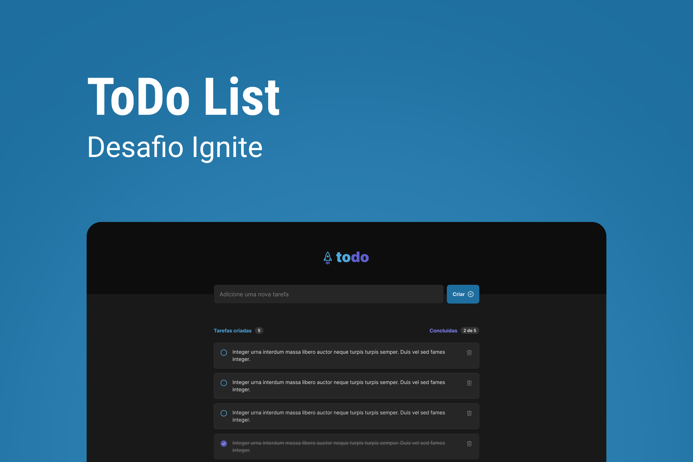

Neste desafio o objetivo era criar uma aplicação front-end em React com uma lista de tarefas seguindo um layout pré-estabelecido com as funcionalidades de adicionar, remover e concluir tarefas.

 

## Projeto
- [Deploy](https://todo-list-thilourenco.vercel.app/)

## Tecnologias

- [Reactjs](www.reactjs.org)
- [Vite](https://vitejs.dev/)
- [Typescript](https://www.typescriptlang.org/)
- [Phosphor-react](https://phosphoricons.com/)
- [uuid](https://www.npmjs.com/package/uuid)

## Regras de negócio

- [x] Adicionar uma nova tarefa
- [x] Marcar e desmarcar uma tarefa como concluída
- [x] Remover uma tarefa da listagem
- [x] Mostrar o progresso de conclusão das tarefas

## Layout
- [Figma](https://www.figma.com/file/0n0zDN7zbzhRbaEO74Xesx/ToDo-List/duplicate)